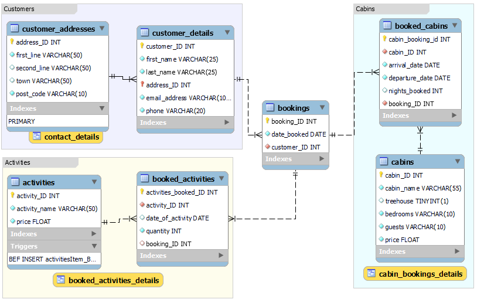

# CFG SQL Course Project

## Code First Girls: Introduction to Data Science and SQL Programming Course
I undertook the Introduction to Data Science and SQL Programming course run by Code First Girls during from October - December 2020. It is an 8 week introductory course and was my first experience of databases and SQL. We used MySQL throughout the course and covered:

- database creation, structure and management  
- basic queries  
- queries with conditions, group by, having    
- subqueries  
- joins and the union operator  
- transactions  
- views  
- stored functions  
- stored procedures  
- events  
- triggers  
- backups 

## Course Project
This repository contains my final project that I created as a requirement of the course. It is a database that contains details of bookings made at an imaginary holiday retreat. The [Create Database](Create_Database.sql) script contains the code used to create and populate the tables while the [Tasks](tasks.sql) script contains the code used to complete the various queries and tasks we were asked to complete such as creating views, stored procedures, running subqueries etc. The repository also contains a backup of the database [Database backup](resort_backup.sql). 
The project was presented to the rest of the group remotely [Project presentation](Presentation.pdf).

